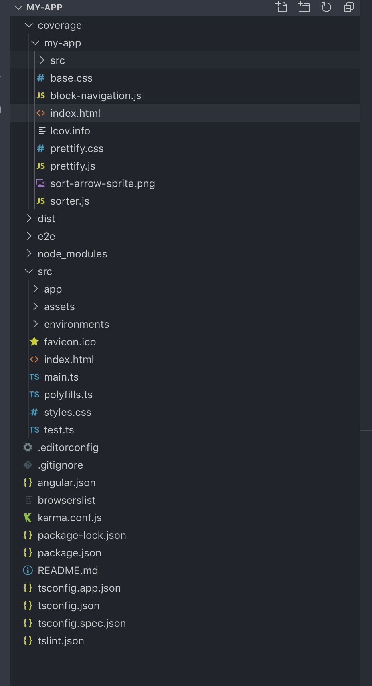

# MyApp

This project was generated with [Angular CLI](https://github.com/angular/angular-cli) version 8.2.2.

## Development server

Run `ng serve` for a dev server. Navigate to `http://localhost:4200/`. The app will automatically reload if you change any of the source files.

## Code scaffolding

Run `ng generate component component-name` to generate a new component. You can also use `ng generate directive|pipe|service|class|guard|interface|enum|module`.

## Build

Run `ng build` to build the project. The build artifacts will be stored in the `dist/` directory. Use the `--prod` flag for a production build.

## Running end-to-end testsw

Run `ng e2e` to execute the end-to-end tests via [Protractor](http://www.protractortest.org/).

## Further help

To get more help on the Angular CLI use `ng help` or go check out the [Angular CLI README](https://github.com/angular/angular-cli/blob/master/README.md).

## Running unit tests

Run `ng test` to execute the unit tests via [Karma](https://karma-runner.github.io).

If you want to create code-coverage reports every time you run the test suite, you can set the following option in the CLI configuration file, angular.json:

```
"test":{
  "options":{
  "codeCoverage": true
  }
}
```

(or) run the below command in the project root directory.

`ng test --code-coverage`

Whenever test suite executed successfully, you will see a “coverage” folder in project root directory.



Open the index.html file in your favorite browser to view the test case coverage for all the files in the project.


